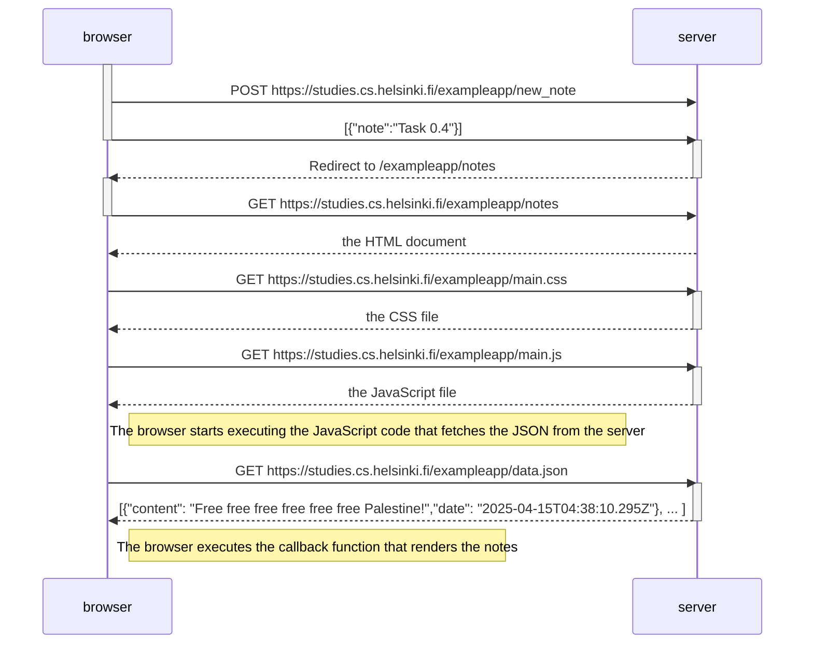

```markdown
## 0.4: New Note Diagram


```mermaid
sequenceDiagram
    participant browser
    participant server

    activate browser
    browser->>server: POST https://studies.cs.helsinki.fi/exampleapp/new_note
    browser->>server:[{"note":"Task 0.4"}]
    deactivate browser
    activate server
    server-->>browser: Redirect to /exampleapp/notes
    deactivate server
    activate browser
    browser->>server: GET https://studies.cs.helsinki.fi/exampleapp/notes
    deactivate browser
    server-->>browser: the HTML document
    
    browser->>server: GET https://studies.cs.helsinki.fi/exampleapp/main.css
    activate server
    server-->>browser: the CSS file
    deactivate server

    browser->>server: GET https://studies.cs.helsinki.fi/exampleapp/main.js
    activate server
    server-->>browser: the JavaScript file
    deactivate server

    Note right of browser: The browser starts executing the JavaScript code that fetches the JSON from the server

    browser->>server: GET https://studies.cs.helsinki.fi/exampleapp/data.json
    activate server
    server-->>browser: [{"content": "Free free free free free free Palestine!","date": "2025-04-15T04:38:10.295Z"}, ... ]
    deactivate server

    Note right of browser: The browser executes the callback function that renders the notes
```